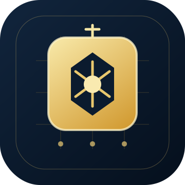

<p align="center">
  
</p>

<h1 align="center">Yangmou Master Skill · 阳谋师 Skill</h1>

<p align="center">
  <b>Turn the "open-board game" methodology into a reusable solving engine — retrieval + LLM multi-layer semantic analysis, covering seven domains: sales / marketing / management / workplace / investing / product / negotiation. Make the opponent walk your script even after seeing right through it.</b>
</p>

<p align="center">
  🇨🇳 <a href="./README.zh-CN.md">中文版</a> &nbsp;|&nbsp;
  🇬🇧 <a href="./README.md">Bilingual (中英)</a>
</p>

<p align="center">
  
  
  
  
  
</p>

---

## What is this?

> **Yangmou Master Skill** is a **cross-tool solving workflow** (native on WorkBuddy / Codex / OpenCode; also usable as a project rule or chat context on Cursor / Claude Code / Codex CLI / Gemini CLI / Qwen Code / Trae, etc.). It is not a "give me some advice" tool. It is a **human-in-the-loop solving workflow**: first it pins down your real game through multi-round questioning, then retrieves yangmou (open-strategy) cases from across history, runs a six-layer semantic analysis (including modern-domain translation), and finally hands you an **open-board move** the opponent knows is a trap yet cannot avoid stepping into.

It handles three things in one pass: **read your game → match a transferable yangmou prototype → translate it into actionable tactics for your domain.**

*Yangmou* (阳谋) = the open-board game: you lay the strategy in broad daylight, and the opponent, though they see through it, is bound by rules, human nature, or the larger trend to move per your script anyway. The classic line from Sun Tzu — "subdue the enemy without fighting" — is its ancestor.

## Highlights

> **Ancient cases provide transferable "lock-in mechanisms"; the model reasons deeply on top of that case base — together they are both accurate and actionable.** — the core design of this skill

- **Real case base (88 cases):** 73 canonical cases (from ten books — *The Art of War*, *Guiguzi*, *Thirty-Six Stratagems*, *Fan Jing*, *Zizhi Tongjian*, *The Prince*, *On War*, *Hou Hei Xue*, *Blood Tribute Law*, *Hidden Rules*) carry **verbatim source quotes + source URLs**; 15 historical / business modern cases (Tesla, Costco, Netflix, Huawei, Ding Yuanjing's vinyl-record gambit, etc.) are likewise sourced.
- **Multi-round questioning to pin the scene:** four dialogue rounds (scene framing → opponent profile → my leverage → red lines) force a vague "I want to win" into a precise "game description."
- **Six-layer semantic analysis:** deconstruct → identify the lock-in mechanism (rules / human nature / the larger trend) → match prototypes → **modern-domain translation** → design the open move & build momentum → anticipate countermoves & defend.
- **Seven domains, no favoritism:** sales / marketing / management / workplace / investing / product / negotiation. Every case carries full seven-domain tactics; you confirm the domain in round one.
- **Lightweight semantic retrieval:** `scripts/retrieve.py` locates the most fitting prototype in seconds, filterable by pillar / domain / book.
- **Clear boundaries — no cheating taught:** yangmou relies on real "momentum." No fakes, no hidden clauses, no mutual-harm schemes — those are yinmou (scheming) and backfire on retention and reputation.

## Supported AI tools (cross-tool)

The core files of this skill (`SKILL.md` / `references/*.md` / `references/cases.json` / `scripts/retrieve.py`) are plain Markdown / JSON / Python, **not bound to any single client**. Pick one of three ways depending on your tool:

| Way | Tools | How |
|---|---|---|
| **① Native skill** (install) | WorkBuddy, Codex, OpenCode | Drop the `yangmou/` directory into the client's skills folder; trigger with plain language in chat |
| **② Project rule / memory file** (fallback) | Claude Code (`CLAUDE.md` or `.claude/skills/`), Cursor (`.cursor/rules/*.mdc`), Codex CLI / Gemini CLI / Qwen Code (`AGENTS.md` / `GEMINI.md`), Windsurf (`.windsurf/rules/`), Cline (`.clinerules`), GitHub Copilot (`.github/copilot-instructions.md`), Trae / Tongyi Lingma (project rules) | Copy `SKILL.md` (full or abridged) into that project-instruction file; the tool then follows the workflow |
| **③ Chat context** (zero-config) | ChatGPT Web, any web / app chat | Paste `SKILL.md` into the chat and describe your game; get the plan per the workflow |

> This skill is a reasoning / knowledge workflow — it does not auto-edit your code, so even without native support, ways ② / ③ work with almost no loss. To run retrieval locally for speed, execute `python scripts/retrieve.py "..."` in any tool's terminal.

## Get started

### Prerequisites

```bash
# 1. Any supported AI dev tool (see "Supported AI tools" above; zero-dependency)
# 2. Recommended: a high-reasoning model (Claude Opus 4.6 / DeepSeek v4 Pro / GPT-5.6)
# 3. (Optional) Python 3.10+ to run the retriever locally
python --version   # 3.10+ suggested
```

### Install the skill

**Way A · Native skill (WorkBuddy / Codex / OpenCode)**
```bash
git clone https://github.com/whishi47/yangmou-skill.git \
  "$HOME/.workbuddy/skills/yangmou"   # WorkBuddy
# Codex:    $HOME/.codex/skills/yangmou
# OpenCode: $HOME/.config/opencode/skills/yangmou
```

**Way B · As a project rule / memory file (Claude Code / Cursor / Codex CLI / Gemini CLI / Qwen Code / Windsurf / Cline / Copilot / Trae, etc.)**
```bash
git clone https://github.com/whishi47/yangmou-skill.git
# Copy SKILL.md into your project-instruction file, e.g.:
cp yangmou/SKILL.md ./CLAUDE.md        # Claude Code (project-level)
# Cursor  → .cursor/rules/yangmou.mdc
# Codex CLI / Gemini CLI / Qwen Code → AGENTS.md / GEMINI.md
# Windsurf → .windsurf/rules/yangmou.md
# Cline    → .clinerules
# Copilot  → .github/copilot-instructions.md
# Trae / Tongyi Lingma → paste SKILL.md into IDE "project rules"
```

**Way C · Paste into chat (ChatGPT Web / any chat)**
Copy `SKILL.md` → paste into the chat → describe your game; get the plan per the workflow.

> On Windows `$HOME` is usually `C:\Users\your-username`. Skills folders differ by client (`.workbuddy` / `.codex` / `.config/opencode`). No build step, no dependencies.

### Usage

| Trigger | Action | Result |
|---|---|---|
| 💬 Natural language | "The client keeps pressing the price, how do I negotiate" | Start skill, enter four-round questioning |
| 💬 Natural language | "How do I lock in repeat customers" | Jump to domain confirm + retrieval |
| 💬 Natural language | "Explain what yangmou is" | Read the principles doc, skip the full flow |
| 💬 Natural language | "Give me a yangmou to handle a tough client" | Questioning → analysis → open-board plan |
| 📎 Scene description | Paste a long game dilemma | Compress into a "game description" and retrieve |

On first trigger, the skill asks four classes of questions **round by round** (2~4 of the same kind per round, advance after you answer): **scene framing**, **opponent profile**, **my leverage**, **red lines**. If you already gave enough in round one, rounds merge, but at least "opponent's want/fear" and "my leverage/rule-power" must be confirmed.

## How it works

```
┌──────────────────────────────────────────────────────────┐
│                yangmou  Yangmou Master Skill                     │
│   Input: your game dilemma (natural language / scenario)   │
└───────────────────────────┬──────────────────────────────┘
                            ▼
   ┌──────────────────────────────────────────────┐
   │ ① Four-round questioning (dialogue)           │
   │   scene → opponent → leverage → red lines     │
   │   → compress into an 80~150 char "game desc"  │
   └──────────────────────┬───────────────────────┘
                           ▼
   ┌──────────────────────────────────────────────┐
   │ ② Retrieve from case base                     │
   │   scripts/retrieve.py "game desc" --top 3      │
   │   (opt --pillar rules|nature|trend            │
   │       --field 7-domains --book title)          │
   │   → 1~3 best-fit prototypes                    │
   └──────────────────────┬───────────────────────┘
                           ▼
   ┌──────────────────────────────────────────────┐
   │ ③ Six-layer semantic analysis                 │
   │   deconstruct → lock-in(3 pillars) → match    │
   │   → modern-domain translation → open move     │
   │   → anticipate countermoves & defend          │
   │   → 3 things to do this week                  │
   └──────────────────────────────────────────────┘
```

**Step ① Four-round questioning:** turn a vague want into a precise "game description" covering your role, the decision-maker / opponent, each side's wants & fears, your leverage, who sets the rules, the time window and bottom line.

**Step ② Retrieval:** feed the "game description" to `retrieve.py`, which locates `references/cases.json` and returns 1~3 prototypes in seconds; narrow with `--pillar / --field / --book`.

**Step ③ Six-layer analysis:** pick 1~2 best-fit prototypes, name the "lock-in mechanism" (which of rules / human nature / the larger trend binds the opponent), translate it into your domain's modern tactics via `现代领域迁移.md`'s tables, design the public "open move" and the "momentum" to build, then anticipate countermoves and defend each.

## Case base

`references/cases.json` holds **88** structured cases:

- **73 canonical cases** (ten books): Art of War (8), Guiguzi (8), Thirty-Six Stratagems (10), Fan Jing (8), Zizhi Tongjian (7), The Prince (8), On War (8), Hou Hei Xue (8), Blood Tribute Law (4), Hidden Rules (4). Each has `source_text` verbatim quote + `source_url` + `lock_mechanism` + `transfer_models` + `fields` (seven-domain tactics).
- **15 historical / business modern cases:** Wei-Prince-saves-Zhao-style management, Tesla's open patents, Costco membership, Netflix's rule rebuild, Huawei's open HarmonyOS architecture, Ding Yuanjing's vinyl gambit, etc. — all sourced.

A sourced index of the 73 canonical cases (quotes + URLs + seven-domain tactics) is in `references/原典阳谋.md`.

## Bundled script

### `scripts/retrieve.py`

A zero-dependency lightweight semantic retriever (bigram matching). It does not call a model, so it is fast and deterministic. It auto-locates `references/cases.json`.

```bash
# Basic: return the top 3 prototypes
python scripts/retrieve.py "client pressing price hard negotiation" --top 3

# Limit by pillar (rules / human nature / the larger trend)
python scripts/retrieve.py "how to lock in members" --pillar 规则 --top 5

# Limit by domain (sales/marketing/management/workplace/investing/product/negotiation)
python scripts/retrieve.py "marketing viral channels" --field 营销 --top 3

# Limit by a specific book
python scripts/retrieve.py "subdue enemy without fighting" --book 孙子兵法 --top 3
```

| Argument | Description |
|----------|-------------|
| positional | Scenario description (natural language; the more specific, the better) |
| `--top N` | Return top N prototypes (default 3) |
| `--pillar` | One of the three pillars: `规则` / `人性` / `大势` |
| `--field` | Domain: `销售` / `营销` / `管理` / `职场` / `投资` / `产品` / `谈判` |
| `--book` | Book title substring filter (e.g. `孙子兵法` / `鬼谷子` / `三十六计` / `反经`) |

## Directory layout

```
yangmou/
├── SKILL.md                          # Skill definition (workflow)
├── README.md                         # Bilingual (中英)
├── README.en.md                      # English version
├── README.zh-CN.md                   # Chinese version
├── images/
│   └── logo.svg                      # Logo used in docs
├── LICENSE                           # MIT license
├── references/
│   ├── cases.json                    # Structured case base (retrieval, 88 cases)
│   ├── 原典阳谋.md                    # Sourced index of canonical cases (73)
│   ├── 书籍索引.md                    # Books to ingest next + spec
│   ├── 阳谋原理.md                    # Principles, 3 pillars, vs yinmou, bounds
│   ├── 阳谋多场景.md                  # Multi-domain maps, question bank, 6-layer, template
│   └── 现代领域迁移.md                # Pillar translation, psych/pricing tables, worksheet
└── scripts/
    └── retrieve.py                   # Lightweight semantic retriever
```

## Boundaries

- **No cheating taught:** no fake data, no hidden clauses, no misleading clients — that is yinmou (scheming) and backfires on retention and reputation. Yangmou relies on real momentum.
- **No mutual harm:** "two peaches kill three scholars"-type schemes are used only to spark healthy urgency or divide competitors, never to wreck a client's own team.
- **Substance first:** if your product / value does not hold up, build the substance before flashing an open board, or it backfires.
- **Evidence before suspicion chains:** suspicion-triggering prototypes need real evidence, or they backfire on reputation.

## License

MIT © 2026
