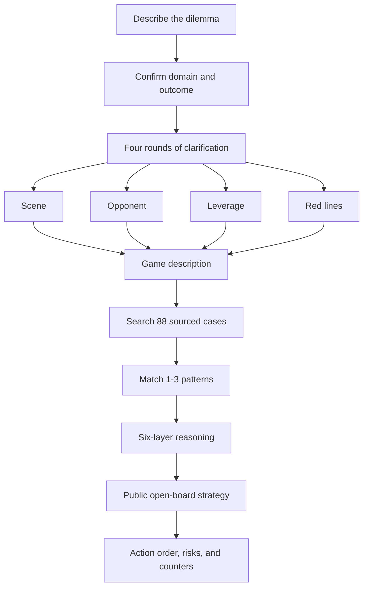

<p align="center">
  
</p>

<h1 align="center">Yangmou Master Skill</h1>

<p align="center">
  <strong>Turn open-board strategy into an executable problem-solving workflow.</strong><br />
  Start with a real dilemma, clarify it through four dialogue rounds, retrieve comparable cases, and produce an ethical, public, actionable strategy.
</p>

<p align="center">
  <a href="./README.zh-CN.md">中文</a> · <a href="./README.md">Bilingual</a> · <a href="#start-in-30-seconds">Start in 30 seconds</a> · <a href="#how-to-use-it">How to use it</a>
</p>

<p align="center">
  
  
  
  
</p>

---

## What problem does it solve?

Some situations are not solved by generic advice: a client keeps squeezing price, a cross-functional initiative is blocked, a competitor is closing in, a negotiation is stalled, or a product must change what users choose.

Yangmou Master Skill does not rush to an answer. It first clarifies **who decides, what each person wants and fears, what real leverage you possess, who sets the rules, and what you cannot afford to lose**. It then matches one to three transferable patterns from 88 sourced cases and designs a public option that the other side can understand, yet still rationally choose because of rules, human incentives, or larger trends.

> Yangmou is not deception or coercion. It does not use fake data, hidden clauses, or harm to others. It requires real value first, then places the open move on the table.

> ⚠️ **Disclaimer**: This skill is for educational and business strategy reference only. All cases are based on publicly documented game-theory principles and historical strategy analysis. The content does not involve, allude to, or comment on any political issues, historical evaluations, or current systems, and does not represent any political stance.

## Start in 30 seconds

**The simplest path:** import this repository as an Agent Skill in your AI tool, or provide the local directory to an AI that can read files. Then describe the situation in plain language.

```text
A client keeps demanding a lower price and using a competitor's quote against us.
I need to protect margin without losing a long-term customer.
Use Yangmou Master Skill to break down this situation.
```

The AI should start by clarifying the situation, not immediately give a conclusion. It will ask questions in rounds, then build the strategy.

## How to use it

### Trigger examples

| Say this | What the skill does | What you receive |
|---|---|---|
| “The client keeps pressing price. How do I negotiate?” | Recognizes a sales / negotiation situation and starts the four rounds | An actionable negotiation structure and open moves |
| “How do I improve member retention?” | Confirms marketing / product context and retrieves rule-based cases | Retention, pricing, or mechanism options |
| “A cross-functional project keeps getting delayed. How do I move it?” | Recognizes a management situation and asks about decision paths and blockers | A path forward, alliances, and countermeasure plan |
| “Explain what yangmou is.” | Reads `references/阳谋原理.md` | A principles explanation, without forcing the full flow |
| “Give me a yangmou for a difficult client.” | Starts the complete workflow | A full public-strategy plan after clarification |
| Paste a long situation | Condenses it into a “game description” | Case matching and an action checklist |

### What happens after you trigger it?



### Step 1: Four rounds of clarification

The AI asks **one round at a time**, rather than dumping a long questionnaire. Each round usually contains two to four focused questions.

| Round | What it clarifies | Typical question |
|---|---|---|
| Scene | Domain, role, desired result | “Is this a one-off deal or a long-term relationship?” |
| Opponent | Real decision-maker, incentives, fears | “Who signs off, and which risk do they fear owning?” |
| Leverage | Your real assets, value, and rule-setting power | “What advantage can you openly show? Who defines the standard?” |
| Red lines | Time, limits, concessions, failure cost | “What is the furthest you can concede? What changes in two weeks?” |

When your initial description already has enough detail, rounds may merge. The skill must still confirm both the opponent's wants or fears and your leverage or rule-setting power before designing the strategy.

### Step 2: Case retrieval

The skill selects one to three fitting patterns from `references/cases.json`. It does not blindly copy an old story.

- **73 canonical cases** from ten works including *The Art of War*, *Guiguzi*, *Thirty-Six Stratagems*, and *Zizhi Tongjian*, with source text and URLs.
- **15 historical and business cases** including Tesla's open patents, Costco membership, Netflix rule resets, and Huawei HarmonyOS.
- Every case includes translations for seven domains: sales, marketing, management, workplace, investing, product, and negotiation.

### Step 3: Six-layer reasoning

A finished answer is not “communicate more” or “offer a discount.” It must complete these layers:

1. **Deconstruct the situation**: participants, goals, blockers, and rules.
2. **Find the lock-in mechanism**: whether rules, human incentives, or larger trends constrain the other side.
3. **Match a pattern**: transfer the structure rather than copy a historical anecdote.
4. **Translate into your domain**: turn it into modern pricing, mechanism, alliance, product, or negotiation actions.
5. **Design the open move and momentum**: decide what to make public and how each party gains reason to choose it.
6. **Anticipate counters**: prepare defenses, alternatives, and an ordered short-term plan.

## Connecting it to AI tools

This is not a plugin that automatically runs just because it is copied to a fixed folder. It is a workflow in the **Agent Skills** format. The correct connection method depends on whether your AI tool supports skill directories, project instructions, or file context.

| Your tool can | Recommended connection | What to do |
|---|---|---|
| Load Agent Skills | Native import | Follow the tool's official instructions to import the whole `yangmou/` directory as a skill |
| Read project instructions | Project reference | Keep the repository in the project and instruct the AI to read and follow `yangmou/SKILL.md` |
| Upload or attach files | File context | Attach `SKILL.md`; attach `references/` or the full directory when case retrieval is needed |
| Only chat | Chat context | Paste the core of `SKILL.md`, then describe the dilemma. Local retrieval cannot run automatically in this mode |

**Examples:** tools with Agent Skills support, such as WorkBuddy, OpenAI Codex, and OpenCode, can use native import first. Claude Code, Cursor, Windsurf, Cline, GitHub Copilot, Gemini CLI, Qwen Code, and Trae should use their current official project-rule, file-context, or skill mechanism. Client configuration locations change over time, so this README intentionally does not hard-code fragile paths.

## Optional local retrieval

You do not need Python or any dependency to discuss a situation with an AI. Python 3.10+ is only needed when you want to query the case base directly on your machine.

```bash
# Download the repository
git clone https://github.com/whishi47/yangmou-skill.git
cd yangmou-skill

# Optional: search the case base locally
python scripts/retrieve.py "client pressing price hard, protect margin" --top 3
python scripts/retrieve.py "move a cross-functional project" --field 管理 --top 3
python scripts/retrieve.py "membership retention mechanism" --pillar 规则 --top 5
python scripts/retrieve.py "subdue the enemy without fighting" --book 孙子兵法 --top 3
```

## What a complete answer includes

- A clear description of your situation, real decision path, and conflict point.
- The mechanism binding the other side and why they may choose the open move even after seeing it.
- One or two matched cases and the transferable elements.
- The public move, supporting mechanism, and momentum-building actions.
- Likely counters, defenses, and alternatives.
- A prioritized short-term action list.

## Repository map

```text
SKILL.md                 Workflow and trigger rules
references/cases.json    88 structured cases
references/阳谋原理.md  Principles, three pillars, and boundaries
references/阳谋多场景.md Domain maps, question bank, and output templates
references/现代领域迁移.md Translation from classical patterns to modern business
references/原典阳谋.md  Sourced index of 73 canonical cases
scripts/retrieve.py      Optional local case retriever
```

## Boundaries

- No fake data, deception, hidden clauses, extortion, or harm to others.
- Cases involving internal conflict or suspicion may be used only for lawful, healthy competitive analysis, never to damage a client or team.
- If value, product, or delivery cannot stand up, build substance before using open-board strategy.

## License

MIT © 2026
