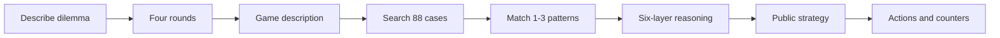

<p align="center">
  
</p>

<h1 align="center">阳谋师 Skill · Yangmou Master Skill</h1>

<p align="center">
  <strong>把“明牌博弈”变成一套可执行的破局工作流。</strong><br />
  Turn open-board strategy into an executable problem-solving workflow.
</p>

<p align="center">
  <a href="#中文">中文</a> · <a href="#english">English</a> · <a href="./README.zh-CN.md">纯中文版</a> · <a href="./README.en.md">English-only</a>
</p>

<p align="center">
  
  
  
  
</p>

---

<h2 id="中文">中文</h2>

## 简介

> **夫阳谋者，明牌之弈也。势虽暴露于敌前，而敌不能避者，非其愚也，乃为规则、人性、大势所制，两害相权取其轻，不得不循我之局而行。昔孙子言「不战而屈人之兵」，鬼谷子论「捭阖」，皆阳谋之祖。今商业与人际之争，客户压价、竞品环伺、同侪相轧，局局皆需明牌之智。本技能萃古之阳谋十书、八十有八例于一案，辅以检索与多层语义推演，使求谋者得破局之明牌，而不假阴谋诡道。**

**阳谋师 Skill** 是一套跨 AI 开发工具通用的“明牌博弈”求解工作流：先借多轮询问锁定你真实的博弈局面，再检索古今天下的阳谋案例，做六层语义分析（含现代领域翻译），最终交付一个**对方明知是坑、也不得不跳的明牌方案**。

## 它解决什么问题？

当客户压价、项目受阻、谈判僵持、竞品围剿，或产品需要改变用户选择时，你需要的不是一句泛泛建议。

**阳谋师 Skill**会先澄清真实局面：谁在决策、各方要什么和怕什么、你的真实筹码、规则由谁定义、你不能失去什么。它再从 **88 条可溯源案例**中匹配原型，交付一个公开、合规、可执行的方案，让对方看懂你的牌后，仍因规则、人性或大势愿意选择它。

> 不教欺骗，不用假数据、隐藏条款或损害他人的手段。先有真实价值，再亮明牌。

## 30 秒开始

把本仓库作为 Agent Skill 导入你的 AI 工具，或让 AI 读取本地 `SKILL.md`，然后直接描述你的困境：

```text
客户一直要求降价，还拿竞争对手报价压我。
我想保住毛利，也不想失去这个长期客户。
请用阳谋师 Skill 帮我拆这个局。
```

正确的 AI 行为是**先澄清，再出方案**。

## 怎么使用

| 你可以这样说 | 技能会怎么做 | 你会得到什么 |
|---|---|---|
| “客户一直压价，怎么谈？” | 启动销售/谈判局澄清 | 谈判结构和明牌动作 |
| “怎么提高会员复购？” | 确认营销/产品场景 | 锁客、定价或机制设计 |
| “跨部门项目总被拖，怎么推进？” | 识别管理局与阻力链 | 推进路径、联盟与反制预案 |
| “讲讲阳谋是什么？” | 阅读原理文档 | 原理讲解，不强制走完整流程 |
| 直接贴一段长背景 | 形成“局的描述” | 案例匹配和行动清单 |


### 四轮澄清

| 轮次 | 要问清什么 | 示例 |
|---|---|---|
| 场景定位 | 你在哪个领域，想达成什么 | “这是单次成交还是长期合作？” |
| 对手画像 | 决策人、诉求与恐惧 | “最终拍板的人最怕什么风险？” |
| 我的筹码 | 真实资源、价值与规则权 | “你可以公开亮出的优势是什么？” |
| 约束红线 | 时间、底线和让步空间 | “最多能让到哪里？” |

完成澄清后，技能会：解构局面，找出规则/人性/大势中的锁死机制，匹配案例，翻译成你的业务动作，设计公开的明牌，再预判对方反制并给出行动顺序。

## AI 工具如何接入？

这是 **Agent Skills 格式的工作流**，不是把文件复制到固定目录就必然自动运行的插件。请按工具能力选择：

| 工具能力 | 推荐方式 | 做法 |
|---|---|---|
| 支持 Agent Skills | 原生导入 | 按该工具官方文档导入整个 `yangmou/` 目录 |
| 支持项目规则 | 项目引用 | 在项目规则中要求 AI 阅读并遵循 `yangmou/SKILL.md` |
| 支持附件/文件上下文 | 文件上下文 | 附上 `SKILL.md`；需要检索时再附 `references/` |
| 仅普通聊天 | 对话上下文 | 粘贴 `SKILL.md` 核心内容，再描述困境 |

WorkBuddy、OpenAI Codex、OpenCode 等支持 Agent Skills 的工具可优先原生导入。Claude Code、Cursor、Windsurf、Cline、GitHub Copilot、Gemini CLI、Qwen Code、Trae 等，请使用其当前官方的项目规则、文件上下文或技能机制。README 不再硬编码易失效的客户端路径。

## 可选：本地案例检索

与 AI 对话不需要 Python。只有独立查询案例库时需要 Python 3.10+：

```bash
git clone https://github.com/whishi47/yangmou-skill.git
cd yangmou-skill

python scripts/retrieve.py "客户强势压价，如何保住毛利" --top 3
python scripts/retrieve.py "跨部门项目推进" --field 管理 --top 3
python scripts/retrieve.py "会员复购机制" --pillar 规则 --top 5
```

完整中文说明见 [README.zh-CN.md](./README.zh-CN.md)。

---

<h2 id="english">English</h2>

## What problem does it solve?

When a client is squeezing price, an initiative is blocked, a negotiation stalls, a competitor closes in, or a product must change what users choose, generic advice is not enough.

**Yangmou Master Skill** clarifies who decides, what each side wants and fears, your real leverage, who sets the rules, and your red lines. It then matches patterns from **88 sourced cases** and delivers an ethical, public, actionable strategy that the other side can understand but may still rationally choose because of rules, incentives, or larger trends.

> No fake data, hidden clauses, or harm to others. Build real value first, then place the open move on the table.

## Start in 30 seconds

Import this repository as an Agent Skill, or let your AI read `SKILL.md`, then describe the dilemma:

```text
A client keeps demanding a lower price and using a competitor's quote against us.
I need to protect margin without losing a long-term customer.
Use Yangmou Master Skill to break down this situation.
```

The correct behavior is **clarify first, propose second**.

## How to use it

| Say this | What happens | What you receive |
|---|---|---|
| “The client keeps pressing price. How do I negotiate?” | Starts sales/negotiation clarification | Negotiation structure and public moves |
| “How do I improve member retention?” | Confirms marketing/product context | Retention, pricing, or mechanism options |
| “A cross-functional project keeps getting delayed.” | Identifies the management blockers | Path forward, alliances, and countermeasures |
| “Explain what yangmou is.” | Reads the principles document | Explanation without forcing the full workflow |
| Paste a long situation | Forms a “game description” | Case matching and action checklist |



The four rounds clarify: **scene**, **opponent**, **leverage**, and **red lines**. The complete workflow then deconstructs the situation, finds a lock-in mechanism in rules/human incentives/trends, transfers a fitting pattern, designs the public move, and prepares counters.

## Connecting it to AI tools

This is an **Agent Skills workflow**, not a fixed-folder plugin. Choose the connection method based on your tool:

| Tool capability | Recommended method | What to do |
|---|---|---|
| Supports Agent Skills | Native import | Import the complete `yangmou/` directory through official instructions |
| Supports project rules | Project reference | Instruct the AI to read and follow `yangmou/SKILL.md` |
| Supports attachments | File context | Attach `SKILL.md`, plus `references/` when retrieval is needed |
| Chat only | Chat context | Paste the relevant part of `SKILL.md`, then describe the dilemma |

For full English instructions, examples, and local retrieval, see [README.en.md](./README.en.md).

## License

MIT © 2026
