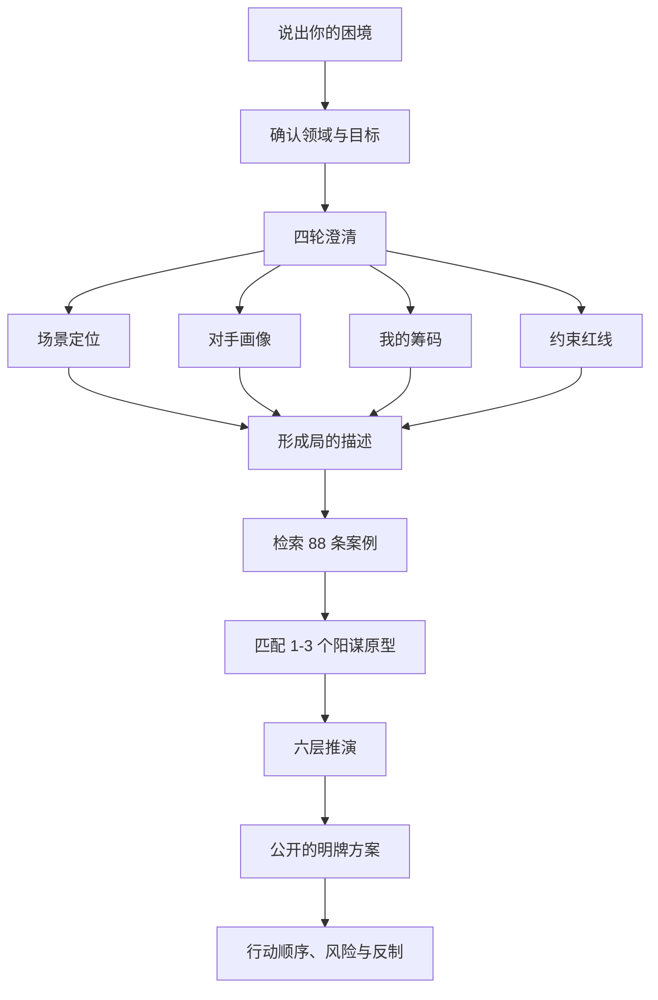

<p align="center">
  
</p>

<h1 align="center">阳谋师 Skill</h1>

<p align="center">
  <strong>把“明牌博弈”变成一套可执行的破局工作流。</strong><br />
  从你的真实困境出发，经过四轮澄清、案例检索和六层推演，给出公开、合规、能落地的策略方案。
</p>

<p align="center">
  <a href="./README.md">双语版</a> · <a href="./README.en.md">English</a> · <a href="#30-秒开始">30 秒开始</a> · <a href="#怎么使用">怎么使用</a>
</p>

<p align="center">
  
  
  
  
</p>

---

## 简介

> **夫阳谋者，明牌之弈也。势虽暴露于敌前，而敌不能避者，非其愚也，乃为规则、人性、大势所制，两害相权取其轻，不得不循我之局而行。昔孙子言「不战而屈人之兵」，鬼谷子论「捭阖」，皆阳谋之祖。今商业与人际之争，客户压价、竞品环伺、同侪相轧，局局皆需明牌之智。本技能萃古之阳谋十书、八十有八例于一案，辅以检索与多层语义推演，使求谋者得破局之明牌，而不假阴谋诡道。**

**阳谋师 Skill** 是一套跨 AI 开发工具通用的“明牌博弈”求解工作流：先借多轮询问锁定你真实的博弈局面，再检索古今天下的阳谋案例，做六层语义分析（含现代领域翻译），最终交付一个**对方明知是坑、也不得不跳的明牌方案**。

它一次性解决三件事：**读懂你的局 → 匹配可迁移的阳谋原型 → 翻译成你所在领域的落地打法**。

> ⚠️ **声明**：本技能仅供商业策略与博弈论的学习研究参考，所有案例均基于公开的古今博弈原理分析，不涉及、不影射任何现实政治议题、历史评价或现行制度。内容不代表任何政治立场。

## 它解决什么问题？

当你面对的是一个“看似没法赢”的局，例如客户不断压价、跨部门项目卡住、竞品正在围剿、谈判相持不下、产品需要改变用户选择时，阳谋师 Skill 不会直接抛一句空泛建议。

它会先问清楚：**谁在决策、每个人要什么和怕什么、你手里有什么真实筹码、规则由谁定义、你不能失去什么**。然后从 88 条可溯源案例中匹配原型，设计让对方看得懂、但基于规则、人性或大势仍愿意选择的公开方案。

> 阳谋不是欺骗，也不是操控。它不使用假数据、隐藏条款或损害他人的手段。它要求先有真实价值，再把“明牌”摆到桌上。

## 30 秒开始

**最简单的方式：**把本仓库作为一个 Agent Skill 导入你的 AI 工具，或把本地目录交给 AI 阅读，然后直接说出你的困境。

```text
客户一直要求降价，还拿竞争对手报价压我。
我想保住毛利，也不想失去这个长期客户。
请用阳谋师 Skill 帮我拆这个局。
```

接下来，AI 应该先进入澄清，而不是马上给结论。它会逐轮问你问题，之后再给方案。

## 怎么使用

### 触发方式

| 你可以这样说 | 技能会怎么做 | 你会得到什么 |
|---|---|---|
| “客户一直压价，怎么谈？” | 识别为销售/谈判局，开始四轮澄清 | 可执行的谈判结构和明牌动作 |
| “怎么提高会员复购？” | 确认营销/产品场景，检索规则型案例 | 锁客、定价或机制设计建议 |
| “跨部门项目总被拖，怎么推进？” | 识别管理局，追问决策链与阻力 | 推进路径、联盟与反制预案 |
| “讲讲阳谋是什么？” | 读取 `references/阳谋原理.md` | 原理讲解，不强制走完整流程 |
| “给我一个搞定难缠客户的阳谋” | 进入完整工作流 | 四轮询问后的完整明牌方案 |
| 直接贴一段长背景 | 压缩成“局的描述” | 从案例匹配到行动清单 |

### 你会经历什么过程？



### 第一步：四轮澄清

AI 会**一轮一轮地问**，不会把一堆问题一次扔给你。每轮通常 2-4 个问题：

| 轮次 | 要问清什么 | 典型问题 |
|---|---|---|
| 场景定位 | 你在哪个领域，想达成什么 | “这次是单次成交，还是长期合作？” |
| 对手画像 | 谁是真正决策人，他在乎什么、怕什么 | “最终拍板的人是谁？他最怕承担哪种风险？” |
| 我的筹码 | 你有哪些真实资源、价值、规则权 | “你能公开亮出的优势是什么？谁有定标准的权力？” |
| 约束红线 | 时间、底线、让步空间和失败代价 | “最多能让到哪里？这局拖两周会发生什么？” |

如果你在第一段描述里已经给足信息，AI 可以合并轮次；但必须确认过“对方诉求/恐惧”以及“你的筹码/规则权”后，才能进入方案设计。

### 第二步：案例检索

技能从 `references/cases.json` 的 88 条案例中选择 1-3 个最贴合的原型，而不是生搬硬套一个典故。

- **73 条原典案例**：来自《孙子兵法》《鬼谷子》《三十六计》《长短经》《资治通鉴》等十部古今战略经典，带原文与出处。
- **15 条历史/商业案例**：包括特斯拉开放专利、Costco 会员制、网飞规则重构、华为鸿蒙等。
- 每条案例都提供销售、营销、管理、职场、投资、产品、谈判七领域的迁移打法。

### 第三步：六层推演

最终方案不是“多沟通”“给点折扣”这类泛建议，而是依次完成：

1. **解构局面**：分清参与者、目标、阻力和规则。
2. **找锁死机制**：对方究竟被规则、人性还是大势约束。
3. **匹配原型**：选择案例中的可迁移结构，不照搬历史故事。
4. **翻译到你的领域**：用现代业务语言变成报价、机制、联盟、产品设计或谈判动作。
5. **设计明牌与造势**：明确什么要公开亮出来，怎样让各方自然愿意选它。
6. **反制推演**：预判对方可能怎么绕开，并给出防御、替代路径和本周行动顺序。

## 用 AI 工具时如何接入？

这不是“任何工具装到固定目录都能自动运行”的插件。它是一套采用 **Agent Skills** 格式的工作流，正确接入取决于你使用的 AI 工具是否支持技能目录、项目指令或文件上下文。

| 你的工具能力 | 推荐接入方式 | 正确做法 |
|---|---|---|
| 支持 Agent Skills | 原生导入 | 按该工具官方文档，将整个 `yangmou/` 目录导入或安装为技能 |
| 支持项目规则 / 指令文件 | 项目内引用 | 把仓库放进项目，并在规则文件中写明“阅读并遵循 `yangmou/SKILL.md`” |
| 支持上传 / 附加文件 | 文件上下文 | 上传 `SKILL.md`，需要案例检索时再附上 `references/` 或整个目录 |
| 仅支持普通聊天 | 对话上下文 | 粘贴 `SKILL.md` 的核心内容，再描述你的困境；此方式无法自动执行本地检索脚本 |

**兼容工具举例：**支持 Agent Skills 的 WorkBuddy、OpenAI Codex、OpenCode 等可优先走原生导入。Claude Code、Cursor、Windsurf、Cline、GitHub Copilot、Gemini CLI、Qwen Code、Trae 等应以各自的官方“项目规则 / 文件上下文 / 技能”机制为准。客户端的配置文件位置会持续变化，所以 README 不硬编码容易过期的路径。

## 安装与本地检索（可选）

如果只想和 AI 对话，不需要运行 Python，也无需安装任何依赖。只有想在本机独立检索案例时才需要 Python 3.10+。

```bash
# 1. 下载到任意你方便管理的位置
git clone https://github.com/whishi47/yangmou-skill.git
cd yangmou-skill

# 2. 可选：独立运行案例检索
python scripts/retrieve.py "客户强势压价，如何保住毛利" --top 3
python scripts/retrieve.py "跨部门项目推进" --field 管理 --top 3
python scripts/retrieve.py "会员复购机制" --pillar 规则 --top 5
python scripts/retrieve.py "不战而屈人之兵" --book 孙子兵法 --top 3
```

> Windows 用户在 PowerShell 中一般使用 `py` 或 `python`。如果命令无法运行，先执行 `py --version` 确认 Python 已安装。

## 它会交付什么？

一次完整求解的输出应当包括：

- 你当前的“局”是什么，真正的决策链和冲突点在哪里。
- 对方被哪种机制约束，为什么看懂你的牌仍可能选择它。
- 1-2 个匹配案例及其可迁移部分。
- 公开要亮出的明牌、配套机制和造势动作。
- 对方可能的反制、你的防守线和替代方案。
- 按优先级排好的短期行动清单。

## 项目内容

```text
SKILL.md                 工作流与触发规则
references/cases.json    88 条结构化案例
references/阳谋原理.md  阳谋原理、三支柱与边界
references/阳谋多场景.md 七领域映射、提问库和输出模板
references/现代领域迁移.md 古案到现代业务的翻译方法
references/原典阳谋.md  73 条原典的可溯源索引
scripts/retrieve.py      可选的本地案例检索脚本
```

## 边界

- 不提供造假、欺骗、隐藏条款、勒索或损害他人的方案。
- “内耗”“猜疑”类案例只可用于合法、健康的竞争分析，不可用于破坏客户或团队。
- 如果自身价值、产品或交付站不住，先补内功，再谈明牌策略。

## License

MIT © 2026
